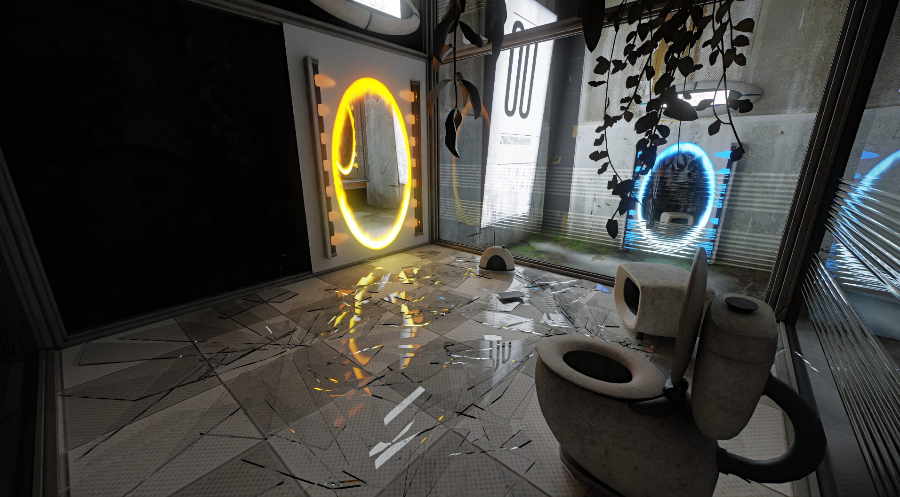
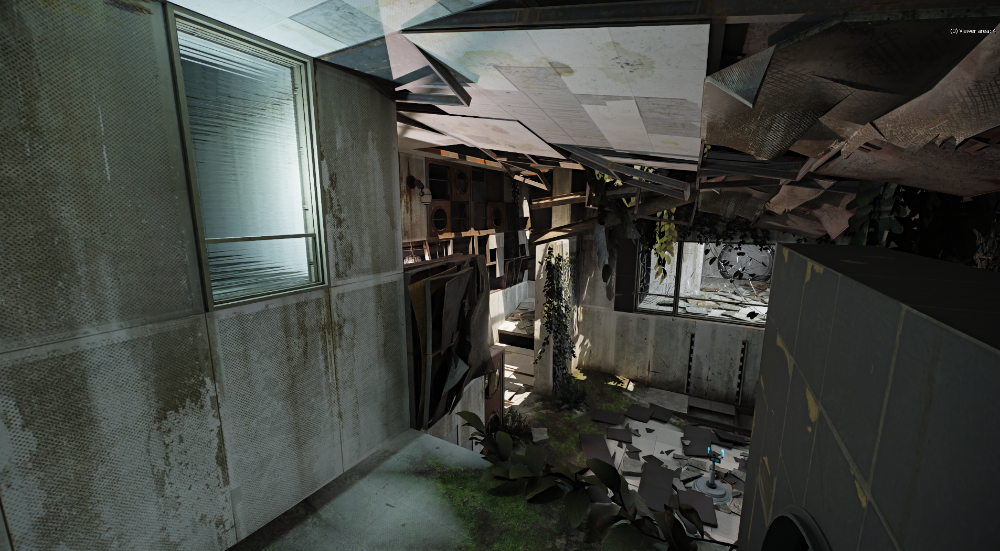

<h1 align="center">Portal 2 RTX Remix Compatibility Mod</h1>

 

This client modification is specifically made for nvidia's [rtx-remix](https://github.com/NVIDIAGameWorks/rtx-remix).  
How does a shader based game work with remix? By manually reimplementing fixed function rendering :) 

 

__WIP__ - __Please Note:__  
RTX Remix was never intented to support Portal 2.  
If you encounter crashes, broken things or similar, it's either due to incompatibility, the limits of fixed function rendering (not being able to get the same result that shaders can achieve) or due to bugs in the compatibility mod itself.  

Please keep that in mind.

### __[ Remix Compatibility Features ]__   
🔹Most things rendered are using the fixed-function pipeline🔹  
🔹Remix friendly culling and the ability to manually override culling per visleaf🔹  
🔹Per map loading of remix config files to set remix variables🔹  
🔹Spawning of unique anchor meshes🔹  

 
 

If you want to support my work, consider buying me some coffee:  

 
 

# Usage / Installation
- Download the latest [release](https://github.com/xoxor4d/p2-rtx/releases) and extract the contents into your portal2 root directory.  
- Start the game by executing `_start_portal2_rtx.bat`
- The window title should change to `Portal 2 - RTX` followed by the GitHub commit number if successful

 

#### ⚠️ Info: 
- Current releases are shipping with a [custom build of the remix-dxvk runtime](https://github.com/NVIDIAGameWorks/dxvk-remix/actions/runs/11506022900) which includes necessary changes  
for GEL rendering (`bin/.trex/d3d9.dll`) 
- For ease of use, releases ship with [Ultimate-ASI-Loader](https://github.com/ThirteenAG/Ultimate-ASI-Loader/releases) (`bin/winmm.dll`)  

#### ⚠️ Current issues:
- Most effects are rendered using shaders. Remix has a floating point precision issue when it comes to shaders. Effects get glitchy the further away you are from the map center. Performance is not the best either (as I had do do some dirty hacks to get them to render).
- ^ Disabled the portal gun viewmodel effects on sp_a1_wakeup because of that

 

# Tweakable Settings:

- A. Commandline Arguments:  

  - `-xo_disable_map_conf` :: disable loading of map specific `.conf` files (remix variables)  
  - `-xo_disable_all_culling` :: disables culling completely (same as enabling `r_novis`) 

 

- B. Console Commands: 

  #### Map Settings:
    - `xo_debug_toggle_node_vis` :: Toggle debug visualization of bsp leafs using the remix API  
    - `xo_mapsettings_update` :: Reload the map_settings.ini file + map.conf    
   
  #### Remix Variables:
    - `xo_vars_parse_options` :: Re-parse the rtx.conf file    
    - `xo_vars_reset_all_options` :: Reset all options to the rtx.conf level  
    - `xo_vars_clear_transitions` :: Clear all ongoing transitions  

 

### Guides

> #### Fix light bleed due to culling: 
- Use cvar `r_lockPvs 1` to prevent vis (culling) updates
- Use cmd `xo_debug_toggle_node_vis`
- Find the leaf (green cube) that is getting culled
- Open the `map_settings.ini` file found in `root/portal2-rtx/`
- Add the map name under `#CULL` followed by a comma + the __[AREA]__ you are in + the __(LEAF)__ number/s
- EG: `sp_a1_intro1, [4](449 452)` (separate multiple leafs by a space)
- Use cmd `xo_mapsettings_update` to reload the map_settings file
- You might need to enter a new area for it to update

This will always force __leaf 449 & 452__ to be visible if you are in __area 4__.

 

> #### Spawn unique map marker meshes
- Use cvar `cl_showPos 1` to see your current position
- Add the map name under `#MARKER` followed by a comma + the __[MAKER_NUM]__ you want to spawn + the __(POSITION)__ 
- EG: `sp_a1_intro4, [0](0 0 0), [1](0 0 20)`
- Use cmd `xo_mapsettings_update` to reload the map_settings file

 

> #### Setting remix variables per map
- Add `your_mapname.conf` to `root/portal2-rtx/map_configs/` which includes all the remix variables you want to change when loading the map. This file will be loaded automatically if it exists.
- You can chain additional config files found in the __map_configs__ folder by adding the map name under `#API_CONFIGVARS` followed by a comma + the `NAME.conf`
- EG: `sp_a1_intro1, chromatic.conf`

 

> #### Making changes to the rtx.conf
- If you intent to tweak remix runtime settings (eg. mark textures) and want to save them afterwards, __make sure__ to use cmd's:
 `xo_vars_reset_all_options` and `xo_vars_parse_options` to restore all runtime settings  
(so they match the rtx.conf settings on disk).
- Why is this important? The map settings logic will tweak remix variables. If you save the runtime settings without resetting them first, you'll overwrite the rtx.conf settings with the per map settings.
- You might want to start the game with the `-xo_disable_map_conf` commandline argument if you intend to, eg. tag a whole bunch of textures in a single session. This will disable map setting config loading.

 

#  Credits
- [Nvidia - RTX Remix](https://github.com/NVIDIAGameWorks/rtx-remix)
- [People of the showcase discord](https://discord.gg/j6sh7JD3v9) - especially the nvidia engineers ✌️
- Yosuke Nathan - Portal 2 Remix Logo

 

