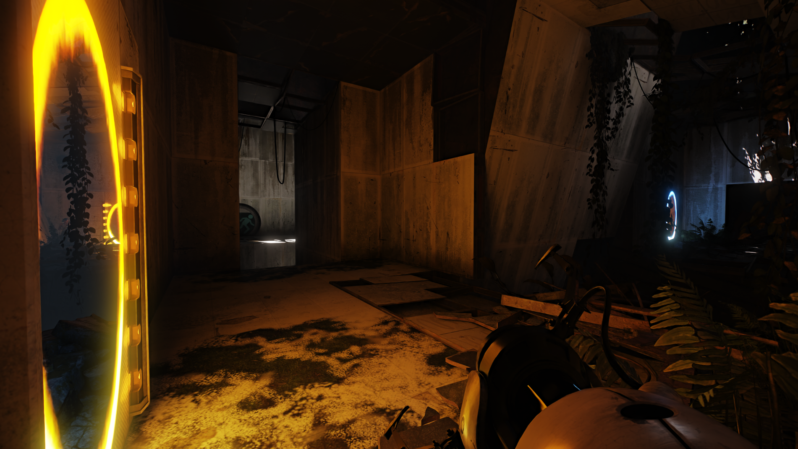
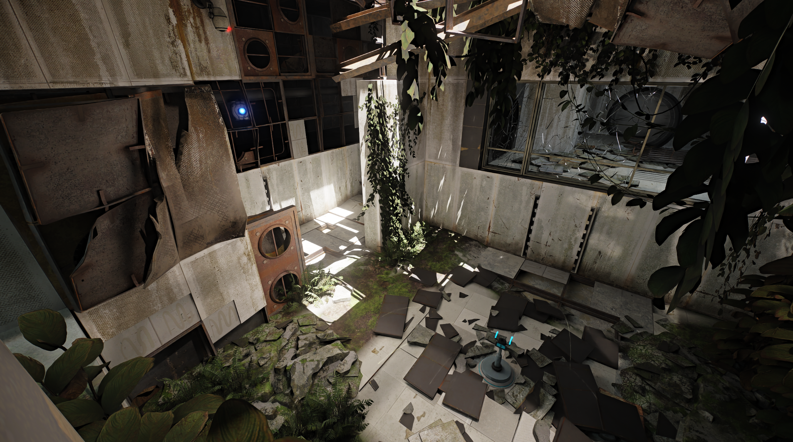
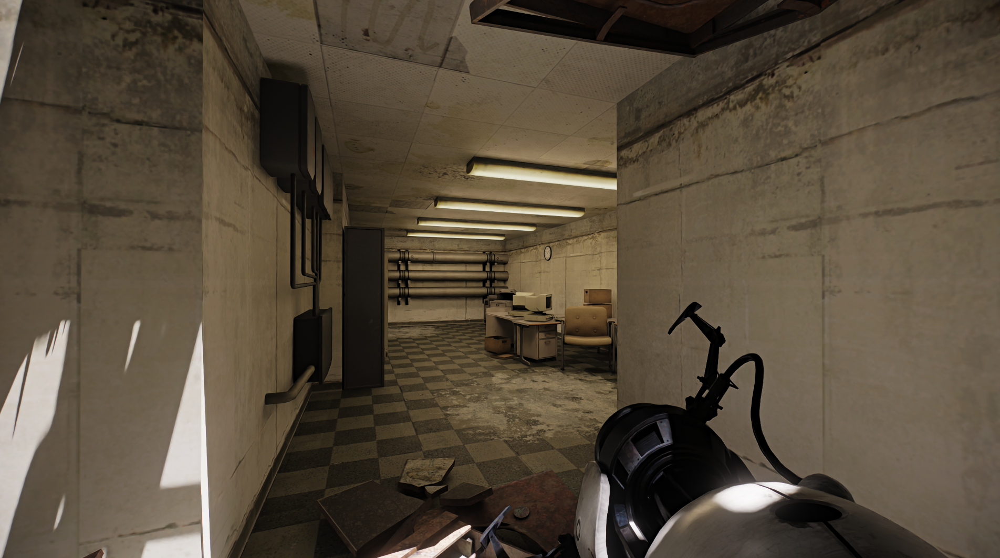
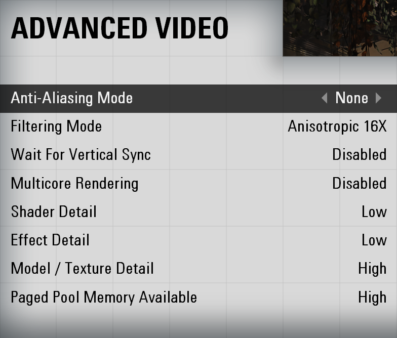

<h1 align="center">Portal 2 RTX Remix Compatibility Mod</h1>

<div align="center" markdown="1"> 

This client modification is specifically made for nvidia's [rtx-remix](https://github.com/NVIDIAGameWorks/rtx-remix).  
How does a shader based game work with remix? By manually reimplementing fixed function rendering :) 

<br>

__WIP__ - __Please Note:__  
RTX Remix was never intented to support Portal 2.  
If you encounter crashes, broken things or similar, it's either due to incompatibility, the limits of fixed function rendering (not being able to get the same result that shaders can achieve) or due to bugs in the compatibility mod itself.  

Please keep that in mind.

</div>
<div align="center" markdown="1">


### __[ Remix Compatibility Features ]__   
🔹Most things are rendered using the fixed-function pipeline🔹  
🔹Remix friendly culling and the ability to manually override culling per visleaf🔹  
🔹Per map loading of remix config files to set remix variables🔹  
🔹Spawning of unique anchor meshes🔹  

<br>
<br>

If you want to support my work, consider buying me some coffee:  

[](https://ko-fi.com/xoxor4d)
</div>

<br>
<br>

# Usage / Installation
- Download the latest [release](https://github.com/xoxor4d/p2-rtx/releases) and extract the contents to your portal2 root directory.  
- The `.zip` with the commit hash contains the comp. mod and the `_remix_mod.zip` contains a base remix-mod
- To avoid rebuilding the sound cache on first startup, copy `_master.cache` from  
`root/portal2/maps/soundcache` to `root/portal2_dlc3/maps/soundcache`
- Start the game by executing `_start_portal2_rtx.bat`
- The window title should change to `Portal 2 - RTX` followed by the GitHub commit number if successful

- [Set graphic options](#graphic-settings) ⚠️ 
> - Shader Detail: Low  
> - Effect Detail: Low  
> - Model /Texture Detail: High  
> - Paged Pool Memory: High  

<br>

#### ⚠️ Info: 
- Current releases ship with a [custom build of the remix-dxvk runtime](https://github.com/xoxor4d/dxvk-remix/tree/combine/pairs_mask_rs) which includes necessary changes  
for Portal 2 (`bin/.trex/d3d9.dll`)  
- Releases also include [Ultimate-ASI-Loader](https://github.com/ThirteenAG/Ultimate-ASI-Loader/releases) (`bin/winmm.dll`)  


#### ⚠️ Current issues:
- A lot of effects are rendered using shaders. Effects can get glitchy the further away you are away from the map center. Performance is not the best either (as I had do do some dirty hacks to get them to render somewhat correctly).
- Expect stuff to be a little broken / looking different 

<br>

<div align="center" markdown="1">



</div>

# Tweakable Settings:

- A. Commandline Arguments:  

  - `-xo_disable_map_conf` :: disable loading of map specific `.conf` files (remix variables)  
  - `-xo_disable_all_culling` :: disables culling completely (same as enabling `r_novis`) 

<br>

- B. Console Commands: 

  #### Map Settings:
    - `xo_debug_toggle_node_vis` :: Toggle debug visualization of bsp leafs using the remix API  
    - `xo_debug_toggle_rayportal_info` :: Toggle debug info for portal pairs spawned via map settings  
    - `xo_mapsettings_update` :: Reload the map_settings.toml file + map.conf    
   
  #### Remix Variables:
    - `xo_vars_parse_options` :: Re-parse the rtx.conf and resets everything (incl. runtime settings - ignoring tex hashes)  
    - `xo_vars_reset_all_options` :: Reset all options (modified by .conf files) to the rtx.conf level  
    - `xo_vars_clear_transitions` :: Clear all ongoing transitions  

<br>

### Guides

> #### Fix light bleed / lights turning off due to culling: 
- Go to spot where culling occurs and use cvar `r_lockPvs 1` to freeze vis updates
- Use cmd `xo_debug_toggle_node_vis`
- Note the current area you are in
- Move into the leaf (green cube) that is getting culled
- Open the `map_settings.toml` file found in `root/portal2-rtx/`
- Add a new entry under `[CULL]` if the map is not listed yet
- Add or edit the __area__ entry and add all the leafs you want to force to __leafs__ 
```toml
sp_a1_intro2 = [
        { area = 4, leafs = [712, 713, 714, 780] },
        { area = 6, leafs = [178, 179, 180, 236] }
    ]
```
- Use cmd `xo_mapsettings_update` to reload the map_settings file
- You might need to enter a new area for it to update
- Disable `r_lockPvs` 

<br>

> #### Spawn unique map marker meshes
- Use cvar `cl_showPos 1` to see your current position
- Add a new entry under `[MARKER]` if the map is not listed yet
- Declare the marker number and the position of the marker
- Duplicates are allowed
```toml
sp_a1_intro3 = [
        { marker = 5, position = [-380, 840, -250] },
        { marker = 6, position = [18, 2283, -363] },
        { marker = 7, position = [-500, -500, 1150] }
    ]
```
- Use cmd `xo_mapsettings_update` to reload the map_settings file

<br>

> #### Setting remix variables per map
- Add `your_mapname.conf` to `root/portal2-rtx/map_configs/` which includes all the remix variables you want to change when loading the map. This file will be loaded automatically if it exists.
- You can chain additional config files found in the __map_configs__ folder by adding the map name under `[CONFIGVARS]`
```toml
    sp_a1_intro2 = { startup = ["chromatic.conf, asd.conf"] }
```

<br>

> #### Making changes to the rtx.conf
- If you intent to tweak remix runtime settings (eg. mark textures) and want to save them afterwards, __make sure__ to use cmd:
  `xo_vars_parse_options` to restore all runtime settings (so they match the rtx.conf settings on disk).
- Why is this important? The map settings logic will tweak remix variables. If you save the runtime settings without resetting them first, you'll overwrite the rtx.conf settings with the per map settings.
- You might want to start the game with the `-xo_disable_map_conf` commandline argument if you intend to, eg. tag a whole bunch of textures in a single session. This will disable map setting config loading.


<br>

#  Credits
- [Nvidia - RTX Remix](https://github.com/NVIDIAGameWorks/rtx-remix)
- [People of the showcase discord](https://discord.gg/j6sh7JD3v9) - especially the nvidia engineers ✌️
- All early access people for testing/bug reporting and for covering my electricity bill ⚡
- Wolƒe Strider Shoσter - for all the high quality bug reports! 
- Yosuke Nathan - Portal 2 Remix Logo

<br>

<div align="center" markdown="1">




</div>


<br>
<br>


# Graphic-Settings

<div align="center" markdown="1">


</div>
